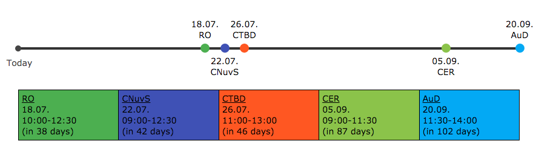

# :)
```shell
bower install
# npm install http-server -g
http-server -o
```

# Anpassen
Einfach die `exams.json` anschauen. Sollte klar sein :) Wenn nicht einfach kurz anschreiben oder Issue erstellen!

